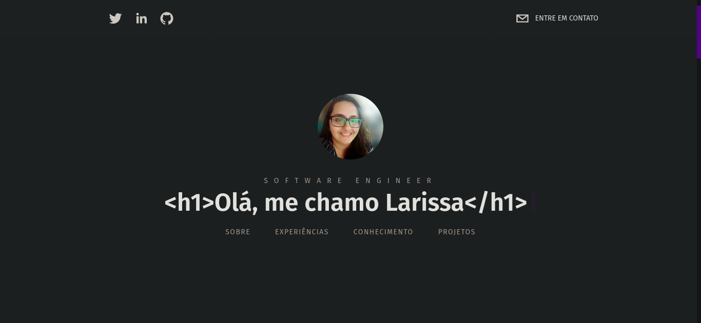
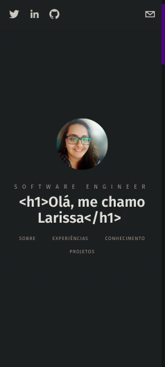
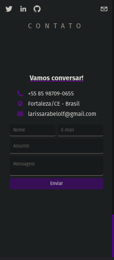

# Portfolio [LIVE PREVIEW](https://www.larissarabelo.com)

&nbsp;&nbsp;&nbsp;
&nbsp;&nbsp;&nbsp;

## 💡 Project

Personal project with NextJS and CMS [Sanity](https://github.com/laripeanuts/v1-portfolio-sanity).

## 🎯 Goals

Develop a project that applied the fundamental concepts of React, NextJS, Tailwind CSS and fulfilled the following requirements:

- [x] Fully Responsive
- [x] Develop with TypeScript
- [x] Integrate project with CMS Sanity
- [x] Use Static Server Render with NextJS
- [x] Complete documentation portfolio

## 🥳 Application

### Web

  

  
  

## 💻 Made with

## 🛠️ Tools

